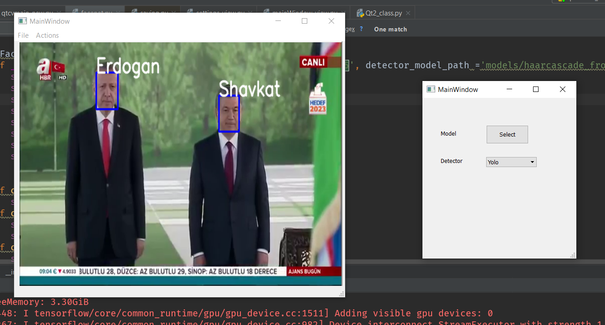

# YoloFace_QT
The GUI application for FaceNet which comes alongside with DLIB and HAAR usage

requriments:
opencv-3.4.4
tensorflow
pyqt

Usage
first download yoloface repository from this url:https://github.com/sthanhng/yoloface
and put in here in YoloFace_Qt directory.
and download weights:
For face detection, you should download the pre-trained YOLOv3 weights file which trained on the WIDER FACE: A Face Detection Benchmark dataset from this link and place it in the models/ directory.
Download the model, [facenet_keras.h5](https://www.dropbox.com/s/xwn57bffg5xobb8/facenet_keras.h5?dl=1) and put it in `models` directory.
	
Keep the face images of people you want to recognize in `databases` directory. 
if you want to detect faces with more accuracy, you can put two or more images in dataset just put numbers as we represented in dataset  directory.

